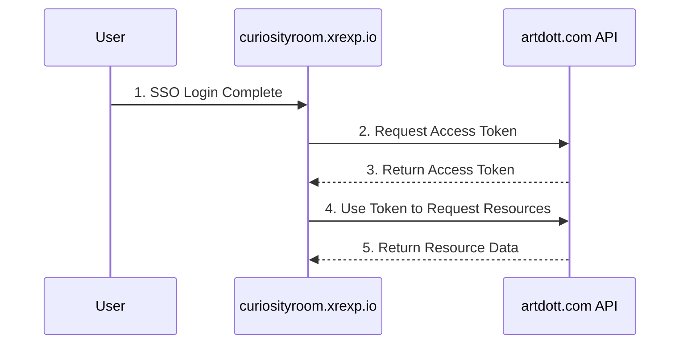

# Cross-Site Resource Access Solution

This document describes how to securely access artdott.com (source site) user resources from curiosityroom.xrexp.io (target site).

## Architecture Design

### 1. Authentication Flow



### 2. API Endpoint Design

#### artdott.com API Endpoint

```python
# artdott.com api/views.py

from rest_framework.views import APIView
from rest_framework.response import Response
from rest_framework.permissions import IsAuthenticated
from rest_framework_jwt.authentication import JSONWebTokenAuthentication

class UserAssetsView(APIView):
    authentication_classes = [JSONWebTokenAuthentication]
    permission_classes = [IsAuthenticated]

    def get(self, request):
        user = request.user
        assets = Asset.objects.filter(user=user)
        
        data = [{
            'id': asset.id,
            'name': asset.name,
            'type': asset.type,
            'url': asset.get_secure_url(),
            'created_at': asset.created_at,
            'thumbnail': asset.get_thumbnail_url() if asset.type == 'video' else None,
            'duration': asset.get_duration() if asset.type == 'video' else None,
            'description': asset.description or ''
        } for asset in assets]
        
        return Response(data)

# urls.py
urlpatterns = [
    path('api/assets/', UserAssetsView.as_view(), name='user_assets'),
]
```

#### curiosityroom.xrexp.io Implementation

```python
# curiosityroom.xrexp.io services.py

import requests
from django.conf import settings

class AssetService:
    def __init__(self, user):
        self.user = user
        self.base_url = settings.SITE_A_API_URL
        
    def get_access_token(self):
        """Get artdott.com access token"""
        payload = {
            'user_id': self.user.id,
            'username': self.user.username,
            'exp': int(time.time()) + 3600
        }
        
        token = jwt.encode(payload, settings.SHARED_SECRET_KEY, algorithm='HS256')
        return token
        
    def fetch_user_assets(self):
        """Get user resources from artdott.com"""
        token = self.get_access_token()
        
        headers = {
            'Authorization': f'Bearer {token}',
            'Content-Type': 'application/json'
        }
        
        response = requests.get(
            f'{self.base_url}/api/assets/',
            headers=headers
        )
        
        if response.status_code == 200:
            return response.json()
        else:
            raise Exception('Failed to fetch assets')

# curiosityroom.xrexp.io views.py
class UserAssetsView(LoginRequiredMixin, View):
    def get(self, request):
        try:
            service = AssetService(request.user)
            assets = service.fetch_user_assets()
            
            return render(request, 'assets/list.html', {
                'assets': assets
            })
        except Exception as e:
            messages.error(request, 'Unable to fetch resource list')
            return redirect('dashboard')
```

## Security Configuration

### 1. artdott.com Configuration

```python
# settings.py

# JWT Configuration
JWT_AUTH = {
    'JWT_SECRET_KEY': 'your-shared-secret-key',
    'JWT_ALGORITHM': 'HS256',
    'JWT_EXPIRATION_DELTA': timedelta(hours=1),
    'JWT_ALLOW_REFRESH': True,
}

# CORS Configuration
CORS_ALLOWED_ORIGINS = [
    "https://curiosityroom.xrexp.io",
]

# Resource Access Control
ASSET_ACCESS_CONTROL = {
    'ALLOWED_SITES': ['curiosityroom.xrexp.io'],
    'MAX_REQUESTS_PER_HOUR': 1000,
    'REQUIRE_HTTPS': True,
}
```

### 2. curiosityroom.xrexp.io Configuration

```python
# settings.py

# artdott.com API Configuration
SITE_A_API_URL = 'https://artdott.com'
SHARED_SECRET_KEY = 'your-shared-secret-key'

# Resource Cache Configuration
CACHES = {
    'default': {
        'BACKEND': 'django.core.cache.backends.redis.RedisCache',
        'LOCATION': 'redis://127.0.0.1:6379/1',
        'OPTIONS': {
            'CLIENT_CLASS': 'django.core.cache.client.DefaultClient',
            'SOCKET_CONNECT_TIMEOUT': 5,
            'SOCKET_TIMEOUT': 5,
            'RETRY_ON_TIMEOUT': True,
        }
    }
}
```

## Supported Resource Types

The following resource types are supported:

1. Image files
2. Document files
3. Audio/Video files
4. Other binary files

## Caching Strategy

curiosityroom.xrexp.io implements multi-level caching for improved performance:

1. **Memory Cache**:
   - Resource metadata cache time: 5 minutes
   - Access token cache time: 55 minutes

2. **Redis Cache**:
   - Resource list cache time: 15 minutes
   - Popular resource cache time: 1 hour

## Error Handling

1. **Network Errors**:
   - Implement retry mechanism
   - Maximum retry attempts: 3
   - Retry interval: exponential backoff

2. **Authentication Errors**:
   - Automatic token refresh on expiration
   - Return to login page on authentication failure

3. **Resource Access Errors**:
   - Record detailed error logs
   - Display user-friendly error messages

## Monitoring and Logging

1. **Performance Monitoring**:
   - API response time
   - Cache hit rate
   - Resource access frequency

2. **Security Monitoring**:
   - Abnormal access patterns
   - Authentication failure count
   - API call limits

## Best Practices

1. **Performance Optimization**:
   - Use CDN for resource access acceleration
   - Implement resource preloading
   - Adopt lazy loading strategy

2. **Security Recommendations**:
   - Regular key rotation
   - Implement request signing
   - Enable HTTPS

3. **Development Guidelines**:
   - Use asynchronous loading
   - Implement resumable uploads
   - Add progress feedback

## Usage Example

```python
# curiosityroom.xrexp.io view example
from .services import AssetService

def display_user_assets(request):
    service = AssetService(request.user)
    
    try:
        # Get user resources
        assets = service.fetch_user_assets()
        
        # Process resource data
        processed_assets = [
            {
                'name': asset['name'],
                'url': asset['url'],
                'thumbnail': asset.get('thumbnail_url') if asset['type'] == 'video' else asset.get('thumbnail'),
                'size': asset.get('size', 0),
                'type': asset['type'],
                'duration': asset.get('duration') if asset['type'] == 'video' else None,
                'description': asset.get('description', '')
            }
            for asset in assets
        ]
        
        return render(request, 'assets/gallery.html', {
            'assets': processed_assets
        })
        
    except Exception as e:
        logger.error(f"Error fetching assets: {str(e)}")
        messages.error(request, 'Error occurred while fetching resources')
        return redirect('dashboard')
```

## Troubleshooting

1. **Resource Access Failure**:
   - Check network connection
   - Verify authentication token
   - Confirm permission settings

2. **Performance Issues**:
   - Check cache configuration
   - Optimize query performance
   - Adjust concurrency settings

3. **Security Issues**:
   - Review access logs
   - Check authentication configuration
   - Update security policies

## Changelog

- v1.0.0 (2025-04-14)
  - Initial version
  - Basic resource access functionality
  - Security authentication mechanism