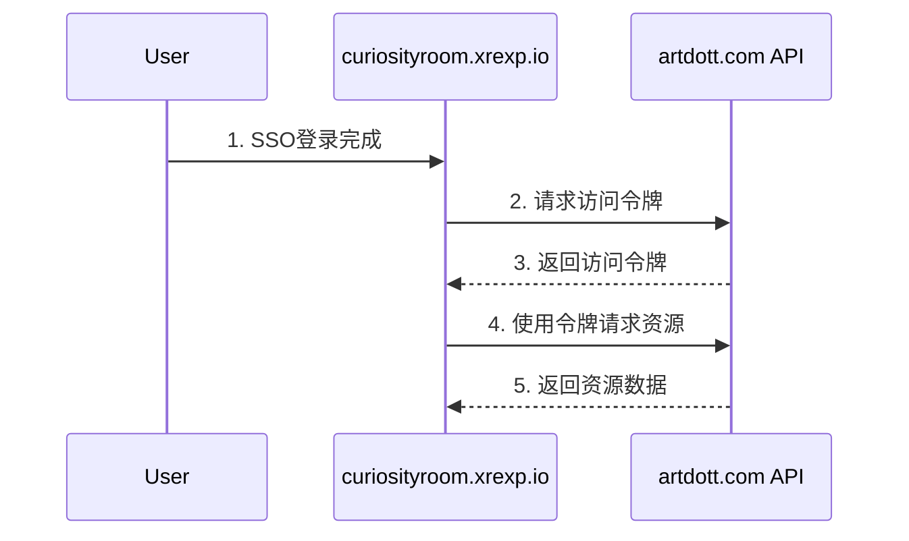

# 跨站点资源访问方案

本文档描述了如何在 curiosityroom.xrexp.io（目标站点）安全地访问 artdott.com（源站点）的用户资源。

## 架构设计

### 1. 认证流程



### 2. API 端点设计

#### artdott.com API 端点

```python
# artdott.com api/views.py

from rest_framework.views import APIView
from rest_framework.response import Response
from rest_framework.permissions import IsAuthenticated
from rest_framework_jwt.authentication import JSONWebTokenAuthentication

class UserAssetsView(APIView):
    authentication_classes = [JSONWebTokenAuthentication]
    permission_classes = [IsAuthenticated]

    def get(self, request):
        user = request.user
        assets = Asset.objects.filter(user=user)
        
        data = [{
            'id': asset.id,
            'name': asset.name,
            'type': asset.type,
            'url': asset.get_secure_url(),
            'created_at': asset.created_at,
            'thumbnail': asset.get_thumbnail_url() if asset.type == 'video' else None,
            'description': asset.description or ''
        } for asset in assets]
        
        return Response(data)

# urls.py
urlpatterns = [
    path('api/assets/', UserAssetsView.as_view(), name='user_assets'),
]
```

#### curiosityroom.xrexp.io 实现

```python
# curiosityroom.xrexp.io services.py

import requests
from django.conf import settings

class AssetService:
    def __init__(self, user):
        self.user = user
        self.base_url = settings.SITE_A_API_URL
        
    def get_access_token(self):
        """获取 artdott.com 的访问令牌"""
        payload = {
            'user_id': self.user.id,
            'username': self.user.username,
            'exp': int(time.time()) + 3600
        }
        
        token = jwt.encode(payload, settings.SHARED_SECRET_KEY, algorithm='HS256')
        return token
        
    def fetch_user_assets(self):
        """获取用户在 artdott.com 的资源"""
        token = self.get_access_token()
        
        headers = {
            'Authorization': f'Bearer {token}',
            'Content-Type': 'application/json'
        }
        
        response = requests.get(
            f'{self.base_url}/api/assets/',
            headers=headers
        )
        
        if response.status_code == 200:
            return response.json()
        else:
            raise Exception('Failed to fetch assets')

# curiosityroom.xrexp.io views.py
class UserAssetsView(LoginRequiredMixin, View):
    def get(self, request):
        try:
            service = AssetService(request.user)
            assets = service.fetch_user_assets()
            
            return render(request, 'assets/list.html', {
                'assets': assets
            })
        except Exception as e:
            messages.error(request, '无法获取资源列表')
            return redirect('dashboard')
```

## 安全配置

### 1. artdott.com 配置

```python
# settings.py

# JWT配置
JWT_AUTH = {
    'JWT_SECRET_KEY': 'your-shared-secret-key',
    'JWT_ALGORITHM': 'HS256',
    'JWT_EXPIRATION_DELTA': timedelta(hours=1),
    'JWT_ALLOW_REFRESH': True,
}

# CORS配置
CORS_ALLOWED_ORIGINS = [
    "https://curiosityroom.xrexp.io",
]

# 资源访问控制
ASSET_ACCESS_CONTROL = {
    'ALLOWED_SITES': ['curiosityroom.xrexp.io'],
    'MAX_REQUESTS_PER_HOUR': 1000,
    'REQUIRE_HTTPS': True,
}
```

### 2. curiosityroom.xrexp.io 配置

```python
# settings.py

# artdott.com API配置
SITE_A_API_URL = 'https://artdott.com'
SHARED_SECRET_KEY = 'your-shared-secret-key'

# 资源缓存配置
CACHES = {
    'default': {
        'BACKEND': 'django.core.cache.backends.redis.RedisCache',
        'LOCATION': 'redis://127.0.0.1:6379/1',
        'OPTIONS': {
            'CLIENT_CLASS': 'django.core.cache.client.DefaultClient',
            'SOCKET_CONNECT_TIMEOUT': 5,
            'SOCKET_TIMEOUT': 5,
            'RETRY_ON_TIMEOUT': True,
        }
    }
}
```

## 资源类型支持

支持以下类型的资源访问：

1. 图片文件
2. 文档文件
3. 音视频文件
4. 其他二进制文件

## 缓存策略

为提高性能，curiosityroom.xrexp.io 实现了多级缓存：

1. **内存缓存**：
   - 资源元数据缓存时间：5分钟
   - 访问令牌缓存时间：55分钟

2. **Redis缓存**：
   - 资源列表缓存时间：15分钟
   - 热门资源缓存时间：1小时

## 错误处理

1. **网络错误**：
   - 实现重试机制
   - 最大重试次数：3次
   - 重试间隔：指数退避

2. **认证错误**：
   - 令牌过期自动刷新
   - 认证失败返回登录页

3. **资源访问错误**：
   - 记录详细错误日志
   - 向用户显示友好错误信息

## 监控和日志

1. **性能监控**：
   - API响应时间
   - 缓存命中率
   - 资源访问频率

2. **安全监控**：
   - 异常访问模式
   - 认证失败次数
   - API调用限制

## 最佳实践

1. **性能优化**：
   - 使用CDN加速资源访问
   - 实现资源预加载
   - 采用懒加载策略

2. **安全建议**：
   - 定期轮换密钥
   - 实现请求签名
   - 启用HTTPS

3. **开发建议**：
   - 使用异步加载
   - 实现断点续传
   - 添加进度反馈

## 使用示例

```python
# curiosityroom.xrexp.io 视图示例
from .services import AssetService

def display_user_assets(request):
    service = AssetService(request.user)
    
    try:
        # 获取用户资源
        assets = service.fetch_user_assets()
        
        # 处理资源数据
        processed_assets = [
            {
                'name': asset['name'],
                'url': asset['url'],
                'thumbnail': asset.get('thumbnail_url') if asset['type'] == 'video' else asset.get('thumbnail'),
                'size': asset.get('size', 0),
                'type': asset['type'],
                'description': asset.get('description', '')
            }
            for asset in assets
        ]
        
        return render(request, 'assets/gallery.html', {
            'assets': processed_assets
        })
        
    except Exception as e:
        logger.error(f"Error fetching assets: {str(e)}")
        messages.error(request, '获取资源时发生错误')
        return redirect('dashboard')
```

## 故障排除

1. **资源访问失败**：
   - 检查网络连接
   - 验证认证令牌
   - 确认权限设置

2. **性能问题**：
   - 检查缓存配置
   - 优化查询性能
   - 调整并发设置

3. **安全问题**：
   - 审查访问日志
   - 检查认证配置
   - 更新安全策略

## 更新日志

- v1.0.0 (2025-04-14)
  - 初始版本
  - 基本资源访问功能
  - 安全认证机制