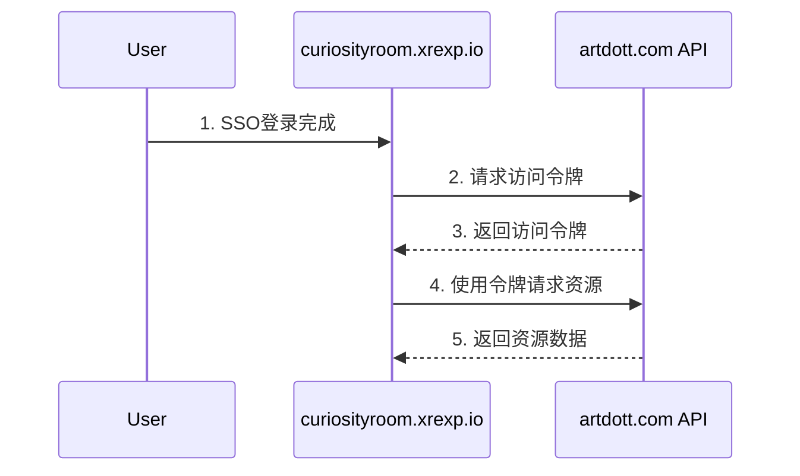

# 跨站点资源访问方案

本文档描述了如何在 curiosityroom.xrexp.io（目标站点）安全地访问 artdott.com（源站点）的用户资源。

## 架构设计

### 1. 认证流程


### 2. 下载库
pip install django-cors-headers
### 3. 自定义JWT验证机制
新建文件custom_jwt_authentication.py

```python
# artdott.com api/custom_jwt_authentication.py

# custom_jwt_authentication.py

from rest_framework.authentication import BaseAuthentication
from rest_framework.exceptions import AuthenticationFailed
import jwt
from django.conf import settings
from django.contrib.auth.models import User


class CustomJWTAuthentication(BaseAuthentication):
    def authenticate(self, request):
        # 从请求头中获取 Authorization 字段

        token = request.GET.get('token')
        if not token:
            raise AuthenticationFailed('Authorization missing')

        try:
            # 使用你的密钥解码自定义 JWT token
            payload = jwt.decode(token, settings.JWT_AUTH['JWT_SECRET_KEY'], algorithms=['HS256'])
        except jwt.ExpiredSignatureError:
            raise AuthenticationFailed('Token is expired')
        except jwt.InvalidTokenError:
            raise AuthenticationFailed('Invalid token')


        username = payload.get('username')
        print(username)
        # 从数据库查询用户（根据 user_id）
        user = User.objects.filter(username=username).first()

        if not user:
            raise AuthenticationFailed('User not found')

        return (user, token)  # 返回用户和 token

```
### 4. API 端点设计

```python
# artdott.com api/views.py

from django.contrib.auth.models import User
from rest_framework.views import APIView
from rest_framework.response import Response
from rest_framework.permissions import IsAuthenticated

from .custom_jwt_authentication import CustomJWTAuthentication


class UserAssetsView(APIView):
    authentication_classes = [CustomJWTAuthentication]  # 使用自定义认证类
    permission_classes = [IsAuthenticated]  # 需要用户认证

    def get(self, request):
        user = request.user
        assets = Asset.objects.filter(user=user)
        
        data = [{
            'id': asset.id,
            'name': asset.name,
            'type': asset.type,
            'url': asset.get_secure_url(),
            'created_at': asset.created_at,
            'thumbnail': asset.get_thumbnail_url() if asset.type == 'video' else None,
            'description': asset.description or ''
        } for asset in assets]

        return Response(data)

# urls.py
urlpatterns = [
    path('api/assets/', UserAssetsView.as_view(), name='user_assets'),
]
```

#### curiosityroom.xrexp.io 实现

```python
# curiosityroom.xrexp.io services.py

# services.py

import requests
import jwt
import time
from django.conf import settings


class AssetService:
    def __init__(self):

        self.base_url = settings.SITE_A_API_URL  # 主服务器地址

    def get_access_token(self):
        """获取 artdott.com 的访问令牌"""
        payload = {

            'username': 'artdott',
            'exp': int(time.time()) + 3600  # 过期时间为1小时
        }

        # 生成 JWT token
        token = jwt.encode(payload, settings.SHARED_SECRET_KEY, algorithm='HS256')
        return token

    def fetch_user_assets(self):
        """获取用户在 artdott.com 的资源"""
        token = self.get_access_token()

        

        response = requests.get(
            f'{self.base_url}/api/assets/?token={token}',
        )

        if response.status_code == 200:
            return response.json()
        else:
            raise Exception('Failed to fetch assets')


# curiosityroom.xrexp.io views.py
from django import http
from django.views import View
from .services import AssetService


class UserAssetsView(View):
    def get(self, request):
        try:
            service = AssetService()  # 获取服务实例
            assets = service.fetch_user_assets()  # 获取资源

            return http.JsonResponse({'assets': assets})
        except Exception as e:
            return http.JsonResponse({'assets': 'wrong'})
# urls.py
urlpatterns = [
    path('test/', views.UserAssetsView.as_view(), name='fetch_resource'),
]
```

## 安全配置

### 1. artdott.com 配置

```python
# settings.py
INSTALLED_APPS = [
    ''''''
    'rest_framework',
    'corsheaders'
]

MIDDLEWARE = [
    'corsheaders.middleware.CorsMiddleware',
    ''''''
]
JWT_AUTH = {
    'JWT_SECRET_KEY': 'your-shared-secret-key',  # 共享密钥
    'JWT_ALGORITHM': 'HS256',
    'JWT_EXPIRATION_DELTA': timedelta(hours=1),  # Token 过期时间
    'JWT_ALLOW_REFRESH': True,
}

# CORS 配置（允许从 8888 端口访问）
CORS_ALLOWED_ORIGINS = [
    "https://curiosityroom.xrexp.io",  # 本地测试
]

# 资源访问控制
ASSET_ACCESS_CONTROL = {
    'ALLOWED_SITES': ['https://curiosityroom.xrexp.io'],
    'MAX_REQUESTS_PER_HOUR': 1000,
    'REQUIRE_HTTPS': False,  # 允许 HTTP 请求（本地测试）
}

# REST_FRAMEWORK 配置
REST_FRAMEWORK = {
    'DEFAULT_AUTHENTICATION_CLASSES': (
        'JWT1.custom_jwt_authentication.CustomJWTAuthentication',  # ！！！路径要自己填写！！！
    ),
}

```

### 2. curiosityroom.xrexp.io 配置

```python
# settings.py

# artdott.com API配置
SITE_A_API_URL = 'https://artdott.com'
SHARED_SECRET_KEY = 'your-shared-secret-key'

# 资源缓存配置
CACHES = {
    'default': {
        'BACKEND': 'django.core.cache.backends.redis.RedisCache',
        'LOCATION': 'redis://127.0.0.1:6379/1',
        'OPTIONS': {
            'CLIENT_CLASS': 'django.core.cache.client.DefaultClient',
            'SOCKET_CONNECT_TIMEOUT': 5,
            'SOCKET_TIMEOUT': 5,
            'RETRY_ON_TIMEOUT': True,
        }
    }
}
```

## 资源类型支持

支持以下类型的资源访问：

1. 图片文件
2. 文档文件
3. 音视频文件
4. 其他二进制文件

## 缓存策略

为提高性能，curiosityroom.xrexp.io 实现了多级缓存：

1. **内存缓存**：
   - 资源元数据缓存时间：5分钟
   - 访问令牌缓存时间：55分钟

2. **Redis缓存**：
   - 资源列表缓存时间：15分钟
   - 热门资源缓存时间：1小时

## 错误处理

1. **网络错误**：
   - 实现重试机制
   - 最大重试次数：3次
   - 重试间隔：指数退避

2. **认证错误**：
   - 令牌过期自动刷新
   - 认证失败返回登录页

3. **资源访问错误**：
   - 记录详细错误日志
   - 向用户显示友好错误信息

## 监控和日志

1. **性能监控**：
   - API响应时间
   - 缓存命中率
   - 资源访问频率

2. **安全监控**：
   - 异常访问模式
   - 认证失败次数
   - API调用限制

## 最佳实践

1. **性能优化**：
   - 使用CDN加速资源访问
   - 实现资源预加载
   - 采用懒加载策略

2. **安全建议**：
   - 定期轮换密钥
   - 实现请求签名
   - 启用HTTPS

3. **开发建议**：
   - 使用异步加载
   - 实现断点续传
   - 添加进度反馈


## 故障排除

1. **资源访问失败**：
   - 检查网络连接
   - 验证认证令牌
   - 确认权限设置

2. **性能问题**：
   - 检查缓存配置
   - 优化查询性能
   - 调整并发设置

3. **安全问题**：
   - 审查访问日志
   - 检查认证配置
   - 更新安全策略

## 更新日志

- v1.0.0 (2025-04-14)
  - 初始版本
  - 基本资源访问功能
  - 安全认证机制
